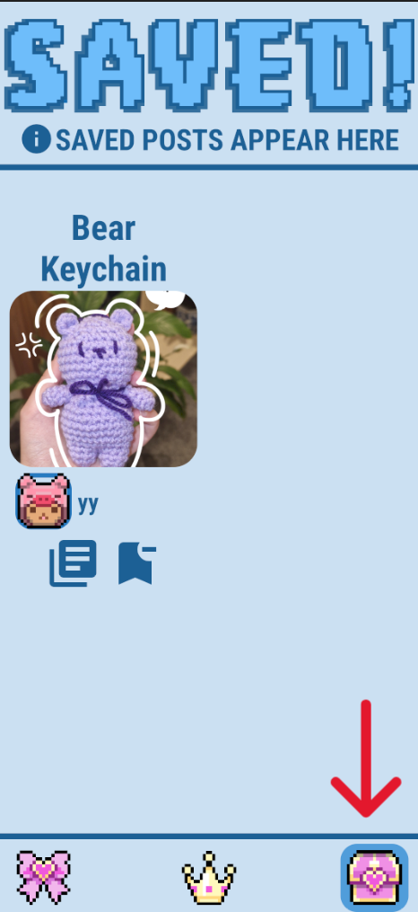
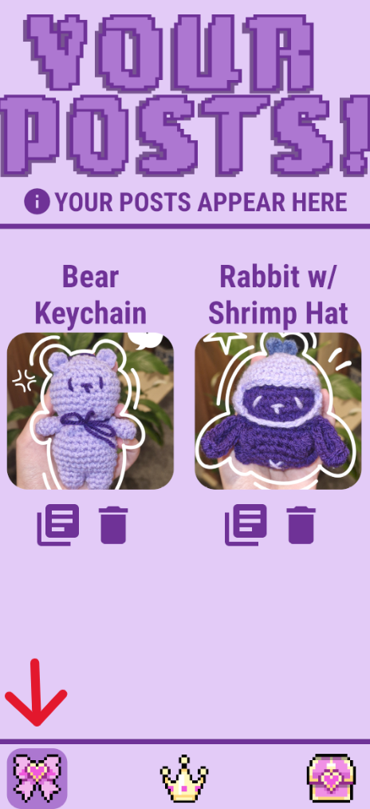

# Hooked! (Crochet Social Media App)
This project is a social media crochet app for Android, designed for crocheters to share and upload their creations and patterns. Users can create accounts, log in using Firebase Authentication, and interact with the app by uploading images, and patterns. All posts are stored securely using Firebase Realtime Database and Firebase Storage.

## Prerequisites
Before running the APK, ensure that you have the following installed on your system:

- Android Studio
- Java Development Kit (JDK): Android Studio comes with a JDK, but ensure it's correctly configured in `File > Project Structure > SDK Location`.
- APK file: Located in 'Releases'
- Android Emulator: Part of Android Studio's setup.

## Download
The latest APK release can be downloaded from the [Releases Section](https://github.com/yonna-k/HookedApp/releases) of this repository.

## Steps to Run APK on Android Emulator
### 1. Open Android Studio
   - Launch Android Studio. You don't need to open a specific project, just Android Studio's main interface.
### 2. Create an Emulator
   - Go to `Tools > Device Manager`
   - Choose `Create Virtual Device`
   - Click `New Hardware Profile` and edit the following properties:
     - **Name:** S22
     - **Screen Size:** 6.1 inch
     - **Resolution:** 1080 x 2340 px
     - **RAM:** 2048 MB
    
   - Choose "Upside Down Cake" as the system image
   - Click 'Next' and 'Finish' to create the emulator

   **To start the emulator, click the play button next to it.**

### 3. Install APK on Emulator (please download the APK from 'Releases' first)
   
   Now that the emulator is running, you can install the APK on it.
   - Drag and drop the APK onto the running emulator's screen
   - The app should be installed and you can click to run it

   Alternatively, you can install the APK from the terminal:
   - Open the terminal: `View > Tool Windows > Terminal`
   - Run the following command:
     ```bash
     adb install path/to/your/apk/file.apk
   - Replace `path/to/your/apk/file.apk` with the actual path to the APK file on your computer.

   - Click to run the app

## Explanation of Features
### Login and Create Account Screens

You **DO NOT** need to create an account. You may log in with the credentials below:
- **Username:** example
- **Password:** password
  
 

After entering your username and password, click the the button indicated by the red arrow to log in.

If you wish to create an account:
- Click the 'Create Account' button at the bottom of the Log In page and enter your desired username and password (password must be 6+ characters)
- Then, log in with the details of the account you just created
### Home Page

This is the main page of the application. You are able to see all user's posts. The posts that you see on the screen are from another account (my account).


The **red arrow** shows the 'Save' button, which saves a post from any user. The posts that you save are stored in a dedicated page (Saved Page).

The **green box** shows the 'Create Post' button, which allows you to create a post.


The **blue arrow** shows the 'Pattern' button, which displays the pattern of a post in a dialog box.


By clicking the profile picture on the top right of the screen, you are directed to the profile page, where you can change your profile picture/log out. Your username is also displayed. Below are 2 accounts (the one on the right being my account - which I posted from).

 

You can press the button at the bottom to exit from this screen.

### Saved Page

You can navigate to this page by pressing the button indicated by the red arrow below:



### Your Posts Page

This page shows all the posts which were posted by the current user. This page should be empty for you until you create a post. The picture below shows the 'Your Posts' page of my (username = "yy") account. You can navigate to this page by pressing the button indicated by the red arrow below:



The **bin icon** allows the user to delete their posts.

## Features I Would Like to Add

This app is not a finished product, and I have several features that I would like to add in the future.
- Being able to 'follow' other users
  - Able to see other user's profiles and click a button to follow.
  - After following, being able to toggle the Home Page's feed so you can see only 'following' users' posts.
- Adding a character limit for the title field of a post.
- Being able to click the photo of a post and have it appear in full screen.
- A way to choose a post to work on, and have a checklist version of the pattern (so the user can crochet along - according to the pattern).
